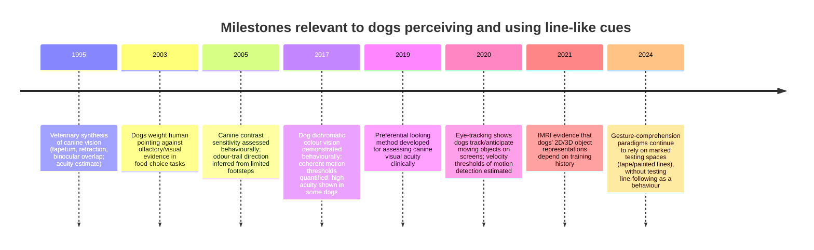

# Do domestic dogs preferentially follow painted or drawn lines?

## Executive summary

The peer‑reviewed experimental literature does not currently provide a direct, well‑controlled test of whether untrained domestic dogs *preferentially follow* painted or drawn lines on the ground (as a locomotor path) over comparable no‑line alternatives, nor of whether they distinguish *painted* lines from *drawn* lines per se when odour, texture, and luminance contrast are controlled. The closest controlled evidence bears on (i) what dogs can *see* (including line/edge detectability given their acuity, colour vision, contrast limitations, and temporal processing) and (ii) how dogs *weight cues* (social gestures, olfaction, and vision) when these sources of information conflict. citeturn15view0turn17view0turn14view0turn18view0turn36view0turn25view0

From a sensory‑ecological standpoint, dogs have sufficient visual capacity to detect high‑contrast linear markings under common lighting, but they have lower spatial resolution than humans on average, are dichromats, and show performance constraints when contrast is reduced—conditions that make line visibility highly dependent on width, luminance contrast, lighting, glare, and colour choice. citeturn41view0turn15view0turn17view0turn14view0turn20view0

Ethologically, “following” in dogs is strongly supported for (a) social following of humans (including reliance on human cues even when those cues contradict sensory evidence) and (b) odour‑based tracking (including the ability to infer track direction from small amounts of odour information). These established following systems create a high prior that, absent training, most dogs will privilege olfactory gradients and/or human motion over a purely visual floor marking—unless the line is made behaviourally relevant via reinforcement or is confounded with other cues (e.g., paint odour, tactile ridge, temperature, or a boundary context). citeturn25view0turn6search3turn49view0turn22view0

Non‑peer‑reviewed historical reports (e.g., mid‑20th‑century claims that dogs avoid crossing bright white lines) exist, but they do not meet modern evidentiary standards and plausibly conflate luminance contrast, glare, novelty, and conditioning; they are best treated as hypotheses‑generating rather than confirmatory. citeturn39view0turn20view0turn31view1

Given the empirical gap, the most defensible conclusion is conditional: dogs can likely be induced to follow painted/drawn lines through training and line design (salience + reinforcement), but an inherent or robust spontaneous preference for line‑following—especially a systematic preference for *painted* over *drawn* lines once non‑visual confounds are removed—remains unproven. The report specifies three detailed experimental designs to test this directly, with controls and sample size targets appropriate for individual variability in dogs. citeturn25view0turn15view0turn14view0turn36view0

## Scope and assumptions

The user request does not specify breed, age, living context, or training history. The analysis therefore assumes:

- Typical companion dogs with mixed prior experiences; no specialised working‑dog training unless stated.
- Ages spanning young adult to older adult, with age treated as a covariate because contrast sensitivity and learning may change with age. citeturn14view0turn33view0
- Indoor and outdoor relevance: indoor surfaces (vinyl, tile, concrete) and outdoor pavements/grass; illumination treated as an experimental factor because canine visual performance varies with light level and adaptation. citeturn15view0turn31view1turn20view0
- “Preferentially follow lines” is operationalised as locomotion that is biased toward travelling *on* or *parallel to* a line more often than expected by chance, or choosing a line‑marked path over a matched unmarked path when other cues are controlled.

A critical methodological assumption (to be tested, not presumed) is that “painted vs drawn” is not a psychologically meaningful category for dogs unless it covaries with (i) odour signatures of paint/chalk/marker, (ii) surface texture/tactile feedback, (iii) luminance contrast/spectral reflectance, or (iv) prior reinforcement histories (e.g., leash training along curbs/edges). citeturn25view0turn14view0turn17view0turn20view2

## Canine visual capabilities relevant to line detection

image_group{"layout":"carousel","aspect_ratio":"16:9","query":["canine eye tapetum lucidum diagram","dog visual field binocular overlap diagram","canine retina rods cones distribution diagram","dog dichromatic color vision spectrum chart"],"num_per_query":1}

### Spatial acuity and what counts as a “visible line”

A widely cited veterinary ophthalmology synthesis characterises dogs as having lower spatial resolving power than humans and frames this as a trade‑off linked to retinal structure and low‑light adaptation. citeturn20view3turn31view1turn41view0

Direct behavioural psychophysics shows large individual (and likely morphological) variation: in a two‑choice grating discrimination paradigm under bright light, a small sample of dogs discriminated gratings in the range of roughly 5.5–19.5 cycles/degree (with some higher estimates depending on thresholding), demonstrating that at least some dogs can resolve relatively fine stripe patterns under favourable conditions. citeturn15view0

Clinical and quasi‑clinical methods also emphasise that detection depends on testing distance and observer reliability. A forced‑choice preferential looking method applied to pet dogs found acuity estimates better at 1 m than at 3 m and showed that measurement reliability was distance‑sensitive. citeturn33view0

Implication for floor lines: a thin line that is readily salient to humans at several metres may be near‑threshold for many dogs unless it has substantial width and high luminance contrast. Conversely, a thick, high‑contrast line (e.g., 5–10 cm wide) should be detectable at typical leash distances for most dogs, but detectability will not guarantee that the line is treated as a *path* rather than as background texture. citeturn41view0turn15view0turn14view0

### Colour vision and why “paint colour” matters more than “paint vs drawing”

Behavioural and physiological work supports dichromatic colour vision in dogs, with two cone classes and reduced discrimination along the human red–green axis. In a behavioural paradigm adapted from human colour‑vision testing, dogs’ responses were consistent with red–green colour blindness analogues in humans; the paper also specifies two cone pigment classes (short‑wave and long/medium‑wave) and reports a final sample of 16 dogs across multiple breeds. citeturn17view0

A practical inference is that many “bright” human colour choices for path markings (notably red/green contrasts) are not guaranteed to be chromatically salient for dogs; luminance contrast and blue/yellow channel contrasts are more reliable. citeturn17view0turn41view0

For line‑following studies, “painted vs drawn” must therefore be decomposed into measurable optical properties: spectral reflectance, luminance contrast against the substrate, and edge sharpness. Otherwise, any observed “preference” may actually be a colour/contrast artefact. citeturn17view0turn14view0

### Contrast sensitivity and the risk of false negatives

Even if a line is spatially resolvable, low contrast can collapse functional visibility. A behavioural method developed in beagle dogs manipulated contrast by increasing luminance of target shapes and found error rates increased as contrast decreased (with worst performance at very low contrast, including 1%). The authors explicitly discuss age effects and diet manipulation, underscoring that canine contrast sensitivity is measurable, variable, and potentially age‑sensitive. citeturn14view0

In the line‑following context, this implies that “chalk on light concrete” or “faded paint” may be effectively invisible or intermittently visible—especially under glare—producing behaviour that looks like “no preference” even if dogs would follow a clearly visible line. citeturn14view0turn31view1turn20view0

### Motion detection and temporal processing

Static ground lines compete with motion and odour as attention drivers. Dogs show robust capacities for tracking moving objects in video stimuli (eye‑tracking evidence with N≈12–14 dogs), supporting that moving cues capture attention and can yield anticipatory looks. citeturn18view0turn19search10

However, dogs are not uniformly “superior at motion” across motion types. In coherent motion detection using random dot displays, dogs (N=5) required high coherence (~42%) relative to humans (~5%), with substantial training effort (tens of sessions) to reach criterion—suggesting that some global motion computations are relatively inefficient in dogs. citeturn36view0

Velocity threshold work (N=6) suggests dogs can detect relatively slow motion under specific trained conditions, with mean individual thresholds spanning roughly 0.26–1.24 deg/s after training to high accuracy. citeturn9view1

Temporal resolution is relevant for any line studies that use projected or screen‑based stimuli: behavioural measurements of critical flicker fusion in dogs (N=4 beagles) show dogs can discriminate flicker at faster rates than previously suggested by ERG alone. citeturn19search0turn18view0

Net relevance: if a “line” is presented as a dynamic cue (projection, moving laser), its visibility and salience profile is not the same as a painted/drawn static marking, and dogs’ responses could be dominated by motion tracking rather than path interpretation. citeturn18view0turn19search0

### Visual field, binocular overlap, and ground‑plane perception

Dog visual ecology differs from humans in field geometry and binocular overlap, with estimates varying by method and morphology; the binocular overlap range is commonly reported as narrower than in humans and potentially influenced by skull/face shape. citeturn20view1turn41view0

This matters because ground lines are typically viewed in the lower visual field during locomotion and are jointly processed with head movement and sniffing posture. Any “line following” paradigm must treat head position, sniffing, and gaze allocation as core dependent variables rather than nuisance variance. citeturn25view0turn18view0

## Following behaviour and cue weighting in dogs

### “Following” is multiply realised in dogs

Dogs follow in at least two well‑supported senses:

- Odour‑trail following: Dogs can infer the *direction* of a human odour trail from limited information; one study describes testing dogs on a footstep trail laid on individual carpet squares and reports that dogs could determine direction from five footsteps but not three. citeturn6search3turn6search1turn49view0
- Social cue following: In object‑choice contexts, dogs often follow human gestures (pointing/gaze) even when those gestures are misleading, and even when other sensory information is available. citeturn25view0turn22view0

These are important because a painted/drawn line is neither an odour trail nor a social gesture unless it is embedded in a communicative routine (e.g., a handler routinely walks “on the line” and reinforces it). citeturn25view0turn21view0

### Social cues can override olfaction in choice contexts

A particularly relevant demonstration of cue weighting is a two‑choice food location series in which dogs had access to olfactory and/or visual evidence about where food was hidden, but human pointing sometimes indicated the incorrect location. Dogs chose above chance using olfactory and visual cues when no human cue was present, but they tended to switch toward the human‑indicated bowl when pointing contradicted their information—especially when their own information was primarily olfactory rather than visual. citeturn25view0

Two implications follow for line‑following claims:

1. If handlers behave as if a line “matters” (slowing, attending, reinforcing), dogs may follow the human routine rather than the line per se.
2. If a line study is run in the presence of humans, subtle experimenter cues (body orientation, gaze, positioning) could dominate outcomes unless controlled (double‑blind where feasible). citeturn25view0turn22view0

### Visual markers are usable, but they are not locomotor paths

Multiple dog cognition paradigms use taped or painted floor markings (start lines, zones, circles) as spatial references and show that dogs can learn or comply with tasks embedded in such marked spaces. For example, in gesture‑comprehension work, the testing area is delineated by tape or mat depending on condition, and dogs are positioned on a start mat facing the experimenter; a painted line is used as part of the experimental setup in marker‑gesture conditions. citeturn21view0turn22view0

This establishes that dogs are not generally “blind” to floor markings and can operate in their presence, but it does not establish that dogs spontaneously treat a line as a route to be followed. citeturn21view0turn22view0

### A caution from 2D/3D representation research

Because lines are 2D surface features, it is relevant that dogs do not always automatically generalise between 2D and 3D object versions. Awake fMRI work shows that dogs’ neural differentiation of 2D versus 3D objects depends on training history: dogs trained with one dimensionality show stronger differential activation for that trained dimension, consistent with limited spontaneous generalisation. citeturn42view0

While floor lines are not “pictures” in the same sense as screen images, this supports a broader methodological point: dogs’ interpretation of a 2D cue is strongly shaped by learning history. Thus, failures to observe intrinsic line‑following should not be taken as evidence that dogs cannot be trained to do so, and successes should not be taken as evidence of an innate preference. citeturn42view0turn25view0

## What empirical evidence exists about dogs following painted or drawn lines?

### Direct evidence: effectively absent (as of the accessible peer‑reviewed record)

Across the primary and review sources examined on canine vision and canine cue use, there is extensive measurement of dogs’ discrimination of gratings (line‑like stimuli), colour/brightness/contrast constraints, and motion processing, but these paradigms are not tests of *ground‑line path following*. citeturn15view0turn17view0turn14view0turn36view0turn9view1

In parallel, studies of dogs’ use of human pointing, physical markers, barriers, and task boundaries often employ floor markings (tape lines, circles, mats) as experimental infrastructure, but they do not report line‑following as a spontaneous behavioural tendency, and they rarely quantify interactions with the markings themselves (sniffing, alignment, path choice). citeturn22view0turn21view0turn33view0

### Why “painted vs drawn” is currently underdetermined

Even if a study reported that dogs “followed a line,” the interpretation would be ambiguous unless the following confounds are neutralised:

- Odour: fresh paint, marker ink, and chalk can have strong volatile signatures, potentially creating an olfactory trail coincident with a visual line. Dogs’ strong olfactory engagement and the known impact of olfaction on decision behaviour make this a first‑order confound. citeturn25view0turn49view0
- Texture: tape ridges, chalk particulate, and paint thickness can create tactile cues under paw pads—especially on smooth floors.
- Luminance contrast and glare: bright paint on dark substrates may produce strong luminance edges, but also specular reflection/glare; dogs’ low‑light adaptations and retinal properties make glare sensitivity plausible. citeturn20view0turn31view1turn14view0
- Prior reinforcement: some dogs may have been reinforced (accidentally or intentionally) for walking near edges/curbs or following handler‑defined paths, creating individual differences that can masquerade as “preference.” citeturn25view0

Given these uncontrolled dimensions, “painted vs drawn” is not currently an interpretable category in the evidence base.

### A historical anecdote: “dogs avoid crossing white lines”

A 1953 popular press report attributes to postal researchers the claim that dogs would not cross a bright white line and would avoid entering circles painted around poles. This report is not peer‑reviewed and includes an inaccurate statement that dogs see only greys/whites, conflicting with modern evidence for dichromatic colour vision and measurable brightness discrimination. citeturn39view0turn17view0turn41view0

The anecdote is nevertheless useful as a testable hypothesis generator: a high‑luminance boundary might function as an aversive visual edge (or a conditioned “do not cross” cue) under specific contexts. But without controlled replication, it should not be treated as evidence that dogs systematically avoid (let alone follow) painted lines. citeturn39view0turn14view0turn25view0

### Comparative table of relevant studies

| Study focus (proxy for line-following) | Design and sample | Key methodological details | Main result relevant to “line” perception/following | Key limitations for line-following inference |
|---|---|---|---|---|
| Dog vision overview | Narrative veterinary review | Summarises retinal specialisations, tapetum, refraction, binocular overlap, acuity constraints citeturn20view0turn20view1turn20view2turn20view3 | Establishes expected trade-offs: good dim-light sensitivity; limits in detail resolution; binocular overlap estimates relevant to ground cues citeturn20view1turn20view3 | Review (not a line-following test); does not address locomotor path cues directly |
| Visual acuity (gratings) | Behavioural psychophysics; small-N | Two-choice vertical vs horizontal gratings; bright vs dim conditions; dogs in multiple breeds, with exclusions; humans tested in same setup citeturn15view0 | Dogs can discriminate gratings up to ~19.5 cpd in bright light (subset), much lower in dim light; large individual variation citeturn15view0 | Gratings on wall, not ground lines; intensive training; limited generalisation to spontaneous behaviour |
| Visual acuity measurement tool | Pilot clinical method; 18 pet dogs | Forced-choice preferential looking; distance effects and observer reliability citeturn33view0 | Acuity estimates depend strongly on viewing distance; reliability better at closer distances citeturn33view0 | Observer-mediated; not a behavioural preference measure |
| Colour vision | Behavioural test; final N=16 | Screen-based moving stimuli; orienting responses; multiple breeds; blue/green/red–green manipulations citeturn17view0 | Behaviour consistent with dichromacy; red–green discriminations impaired in specific stimulus contexts citeturn17view0 | Screen presentation; does not test ground markings |
| Contrast sensitivity (age/diet) | Behavioural discrimination in beagles; multi-group | Contrast reduced by luminance manipulation; includes age groups and diet manipulation (abstract-level details) citeturn14view0 | Errors increase as contrast decreases; suggests age-related contrast sensitivity deterioration citeturn14view0 | Full quantitative CSF not provided in accessible abstract; not a line-following task |
| Flicker fusion (temporal resolution) | Psychophysics; N=4 beagles | Conditioned suppression to estimate critical flicker fusion citeturn19search0 | Dogs discriminate flicker at higher rates than earlier ERG-based suggestions citeturn19search0turn18view0 | Indirect for painted lines; mostly impacts screen/projection methodologies |
| Motion processing (coherent motion) | Conditioned discrimination; N=5 dogs + 5 humans | Random-dot displays; psychometric thresholding; many training sessions for dogs citeturn36view0 | Dogs show high coherence thresholds (~42%) vs humans (~5%); challenges “dogs excel at motion” generalisation citeturn36view0 | Learned discrimination; not about path selection |
| Motion velocity thresholds | Trained method-of-limits; N=6 dogs | Random-dot displays; training to ≥90% accuracy then threshold measurement citeturn9view1 | Dogs detect slow motion with individual thresholds ~0.26–1.24 deg/s after training citeturn9view1 | Again: trained visual discrimination; not ground lines |
| Cue weighting: olfaction vs vision vs pointing | Two-choice food tasks; multi‑group (N varies by group; Study 2 N=30) | Dogs use olfactory/visual info but shift toward human pointing, especially when only olfactory evidence is available citeturn25view0 | Establishes that “following” may reflect social cue following even against sensory evidence citeturn25view0 | Not about lines; but critical for controlling experimenter effects |
| Odour trail direction | Tracking study; N=6 | Footstep trails on separate substrates; minimum steps for direction discrimination citeturn6search3turn6search1 | Direction inferred from ~5 footsteps (not 3), highlighting potency of odour gradients for “following” citeturn6search1turn49view0 | Odour-based; shows why visual line effects may be masked without stringent odour control |
| 2D vs 3D object processing | Awake fMRI; N=15 | Dogs trained on 2D or 3D objects; brain responses depend on training citeturn42view0 | Dogs do not automatically generalise between 2D and 3D versions; training shapes representation citeturn42view0 | Floor lines are not screen images, but result supports learning-dependence of cue interpretation |

## Analogous studies in other species and canids

### Canids and linear features as movement corridors

Although “painted lines” are not ecological features, canids (and other large mammals) often use *linear landscape features* (roads, trails, seismic lines) as travel corridors because they can reduce locomotor costs, increase travel speed, and structure movement. A GPS‑collar study of wolves reports selection for multiple classes of linear features and documents faster movement on certain linear feature types compared with forest, with quantitative comparisons across seasons and feature classes. citeturn45view1turn45view2turn45view3

This literature is informative by analogy: it establishes that movement aligned with linear structure can be adaptive. However, it does not imply that dogs should follow a *paint stripe* on an otherwise homogeneous surface, because those ecological linear features differ dramatically in affordances (surface firmness, openness), odour deposition, and learned expectations. citeturn45view0turn49view0turn25view0

### Line-like cues in comparative perception research

Across species, “lines” often enter the literature as (i) edges/boundaries shaping thigmotaxis and exploration or (ii) visual structure supporting route following and object discrimination. The key translational point for dogs is that line perception is not sufficient: a line must be bound to an action policy (approach, avoid, traverse, align) through reinforcement, ecological affordance, or innate constraints. The dog evidence base strongly supports learning- and context-dependence of cue use (including social-context effects). citeturn25view0turn42view0

### Timeline of relevant evidence



## Research gaps and proposed experiments

### Gap analysis

The limiting gap is not “can dogs see lines?”—they can under many conditions. The gap is whether a *static ground line* is (a) intrinsically treated as a navigational affordance and (b) differentially effective depending on whether it is painted or drawn once odour/tactile/contrast cues are controlled. The existing data strongly predict large individual differences and strong learning effects, implying that single‑session, small‑N demonstrations will be underpowered and confounded. citeturn15view0turn14view0turn25view0turn42view0

### Experimental design principles (cross-cutting)

Across candidate experiments, the following controls are non‑optional:

- Double‑blind handling where possible; at minimum, handler gaze and body orientation controlled, given dogs’ sensitivity to human cues. citeturn25view0turn22view0
- Odour control: line application materials must be odour‑matched (or aged to odour‑neutral) and flooring cleaned between trials; otherwise “line following” could simply be scent tracking. citeturn49view0turn6search3turn25view0
- Photometry and reflectance documentation: report luminance contrast (Michelson or Weber) between line and substrate; include lighting (lux), glare conditions, and line width. Contrast failures are a leading cause of false negatives. citeturn14view0turn31view1turn33view0
- Pre‑registration of primary outcome(s): e.g., path choice proportion; time-on-line; deviation distance; sniffing time; gaze-to-line counts.

### Proposed experiments table

| Proposed experiment | Hypothesis | Key IVs (manipulated) | Controls | Primary DVs (outcomes) | Sample size target (rationale) | Statistics |
|---|---|---|---|---|---|---|
| Baseline preference test: line-marked vs unmarked corridor | H1: Untrained dogs will not exceed ~50% preference for the line-marked path once odour/contrast are controlled; any preference will depend on line salience (contrast/width) rather than “paint vs draw” | Line presence (present/absent); line type (paint vs chalk/marker vs tape); line contrast (high vs low); line width (e.g., 2 cm vs 10 cm) | Odour-matching/ageing; identical substrate texture; counterbalanced side; handler blind to baited side (if bait used) | Choice proportion; latency; time aligned within a corridor band of the line; sniffing duration | N≈50–80 dogs, within-subject (multiple trials/conditions). Rationale: small preference effects (e.g., 0.55 vs 0.50) require hundreds of independent choices; individual clustering reduces effective N, so dog-level N must be moderately large | GLMM logistic (choice ~ line*type*contrast*width + covariates, random intercepts for dog); LMM/GLMM for latency; correction for multiple comparisons |
| Training acquisition study: learn to follow a line to reward | H2: Dogs can learn a “follow line” operant rule; acquisition rate will be faster for high-contrast lines and for lines supplemented with odour cues; paint vs draw alone will not matter once salience is equalised | Training cue type: visual line only vs visual+odour vs odour-only; line type (paint vs chalk); reinforcement schedule | Standardised shaping protocol; balanced trainer effects; control for motivation (treat preference test) | Trials-to-criterion; path deviation; retention after delay; generalisation to novel colour/texture | N≈60 (20 per training arm) provides reasonable power for medium effects in trials-to-criterion given expected heterogeneity; increase to N≈90 if breed/age stratification planned | Survival analysis (Cox) or mixed-effects models for trials-to-criterion; repeated-measures models for retention/generalisation |
| Disentangling “boundary” vs “path”: line crossing vs line following | H3: If lines matter spontaneously, effects may present as *avoidance/crossing inhibition* rather than path following; avoidance will increase with high luminance contrast and under glare-like lighting | Line contrast (high vs low); lighting condition (diffuse vs glare); line meaning (neutral vs conditioned “do not cross”) | Texture/odour controls; habituation; randomised order; include sham line with matched odour but no visible contrast | Crossing latency; number of crossings; stress proxies (speed changes, hesitations); gaze-to-line | N≈40–60 dogs sufficient for within-subject latency differences if effects are moderate; larger N needed if effects are subtle and context-dependent | Mixed-effects models for latency/counts; Bayesian hierarchical models to estimate individual variability; preregistered contrasts |

### Schematic procedure for the baseline preference test

```mermaid
flowchart TD
  A[Recruit dogs; screen for vision impairment history] --> B[Habituation session in test room]
  B --> C[Odour/texture calibration of stimuli\n(paint/chalk aged; substrate cleaned)]
  C --> D[Randomise trial order and corridor side]
  D --> E[Trial: start position -> release]
  E --> F{Dog chooses corridor?}
  F -->|Yes| G[Record choice, latency, trajectory, sniffing, gaze-to-line]
  F -->|No within time limit| H[Abort trial / refamiliarise per protocol]
  G --> I[Inter-trial cleaning; reset]
  I --> D
  G --> J[Model: GLMM + dog-level random effects]
  J --> K[Estimate preference by condition; test interactions]
```

## Practical implications for path design, training, and enrichment

### Designing lines that dogs can perceive

For applications where a ground marking is intended to guide a dog (training lanes, enrichment mazes, workplace navigation cues), the evidence supports designing for canine luminance‑driven visibility rather than human aesthetics:

- Prefer high luminance contrast against the substrate, and verify visibility under the actual illumination (indoor glare, outdoor sun). Contrast sensitivity constraints and distance effects make this more important than fine detail. citeturn14view0turn33view0turn20view0
- Use sufficient width: given canine acuity constraints and variability, narrow lines are at elevated risk of being functionally ignored at normal working distances. citeturn41view0turn15view0turn33view0
- Avoid assuming red/green salience: dog dichromacy makes colour choices non‑equivalent to human perception; blue/yellow and brightness contrast are more dependable. citeturn17view0turn41view0

### Training dogs to follow a line

Because spontaneous preference is not established, reliable line-following should be treated as a trained behaviour:

- Pair the line with reinforcement contingencies (e.g., reward for maintaining position on/near the line; shaping for longer durations), acknowledging that dogs’ cue use is highly learning‑dependent. citeturn25view0turn42view0
- Minimise competing cues during acquisition: odour trails, human body orientation, and motion cues can dominate. citeturn25view0turn49view0
- For older dogs or dogs with suspected visual decline, increase contrast and reduce distance demands, consistent with age sensitivity in visual function measures. citeturn14view0turn33view0

### Enrichment and welfare applications

If the goal is enrichment rather than strict guidance, the strongest evidence suggests leveraging dogs’ established strengths:

- Odour trails and scent‑based puzzles align with dogs’ robust olfactory tracking abilities and can be structured spatially in ways that mimic “lines” without relying on vision. citeturn49view0turn6search3turn25view0
- If visual enrichment is used (projected moving cues, screens), account for dogs’ temporal processing and flicker sensitivity; what appears smooth to humans can be flickery or attention‑disruptive to dogs. citeturn19search0turn18view0

### Bottom line for the specific question

A claim that dogs *preferentially follow* painted or drawn lines (as paths) is not currently supported by targeted peer‑reviewed evidence. What is supported is the conditional substrate: dogs can perceive line-like stimuli under appropriate contrast/width/light, can be trained to treat such cues as meaningful, and will often prioritise olfactory or social information unless the task structure and learning history makes the line predictive. citeturn15view0turn14view0turn17view0turn25view0turn42view0